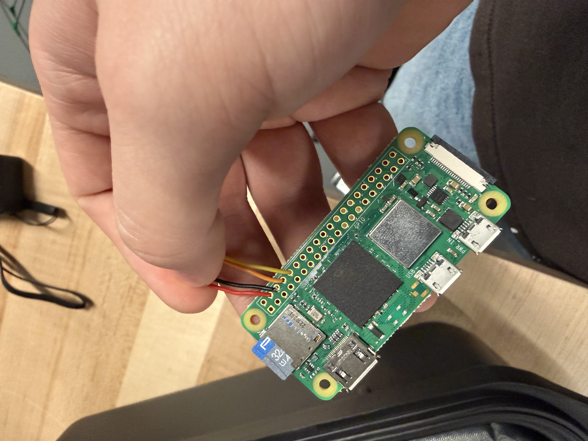
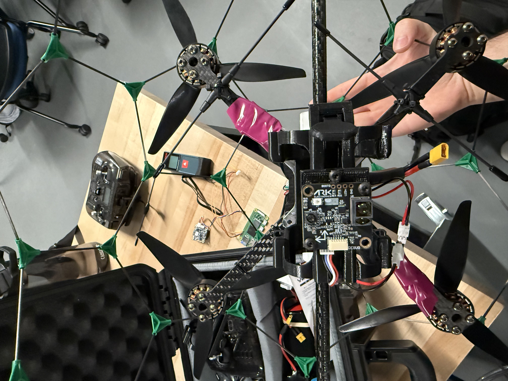
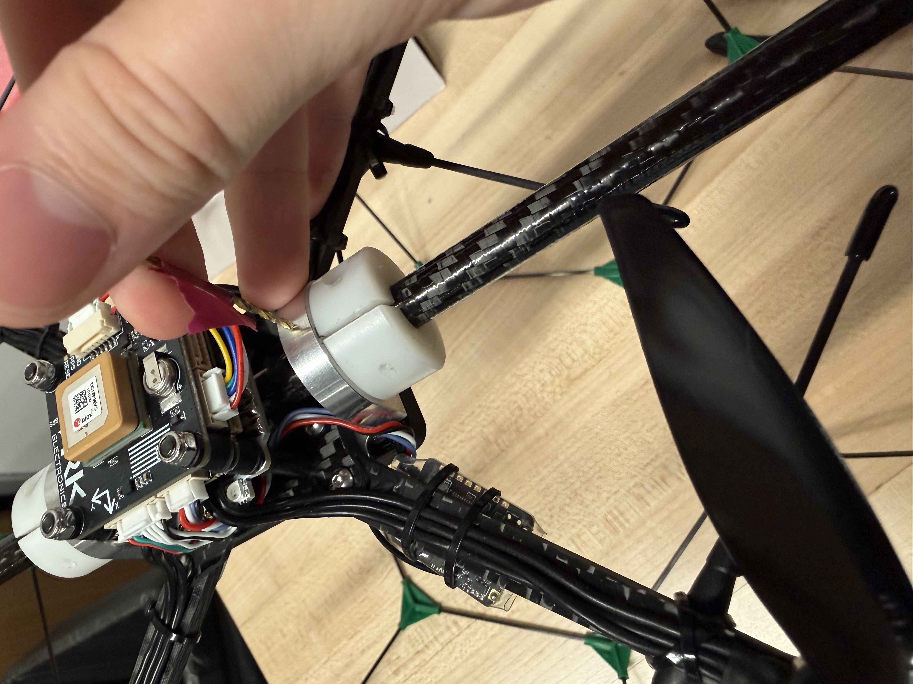

# Horus Drones

18-inch FPV caged drones for researching **emergent behaviors** in autonomous multi-drone systems.

This document is the build and bring-up procedure for making a Horus drone airworthy and capable of autonomous flight.

---

## Overview

Bring-up happens in two phases. **Do not start the software phase until all three hardware checks pass.** Each phase ends with a confirmation gate — everything in the checklist must be true before moving on.

---

## Phase 1 — Hardware

1. **Raspberry Pi Zero 2W power wiring**
   Re-solder the Raspberry Pi Zero 2W so that **ground and power share the telemetry-in port**.

   

2. **ARK-Flow mount**
   Print the ARK-Flow bracket and attach the sensor to the **bottom of the battery holder**. Make sure that 
   the arkflow's **Y direction** points in the same direction as the **flight controllers X direction** (marked on top of the 
   GPS module)

   

3. **Bearing lock**
   Lock the bearings in place: seat them with a **1/16" drill bit**, then drill an **M3 screw** through the bearing and **only slightly into the shaft** (do not bottom out into the shaft).
   An important note, when you lock the bearings with a screw make sure the drone is level with the ground. There are two hexagons on the cage opposite eachother that allow the drone to sit horizontally flat with the ground.

   

### ✅ Hardware confirmation gate

Do not proceed until **all** of the following are confirmed:

- [ ] Raspberry Pi Zero 2W powers on and boots correctly
- [ ] Drone is locked on its shaft
- [ ] ARK-Flow is attached and powers on correctly

---

## Phase 2 — Software

1. **Flash the Pi**
   Flash the Raspberry Pi Zero 2W with **32-bit Raspberry Pi OS Lite** (no-desktop version).

2. **Update flight controller firmware**
   Update the drone's flight controller to the current firmware.

3. **Load parameters**
   Upload `horus.params` to the flight controller via **QGroundControl**.

4. **Install and configure mavp2p**
   Install `mavp2p` and set the correct IPs:
   - one endpoint for the **Raspberry Pi** to use
   - one endpoint for the **ground station laptop**

5. **Verify hover**
   Confirm and test that `hover_test` works. Set up the controller with the necessary kill switch before any powered flight.

### ✅ Software confirmation gate

- [ ] Pi flashed and booting from Pi OS Lite (32-bit)
- [ ] Flight controller firmware updated
- [ ] `horus.params` loaded via QGroundControl
- [ ] `mavp2p` installed with correct Pi + ground-station IPs
- [ ] `hover_test` passes

---

## ⚠️ Controller Requirements

Before any flight, the controller **must** have both of the following mapped:

- **Motor kill switch**
- **Flight mode switch**

---
